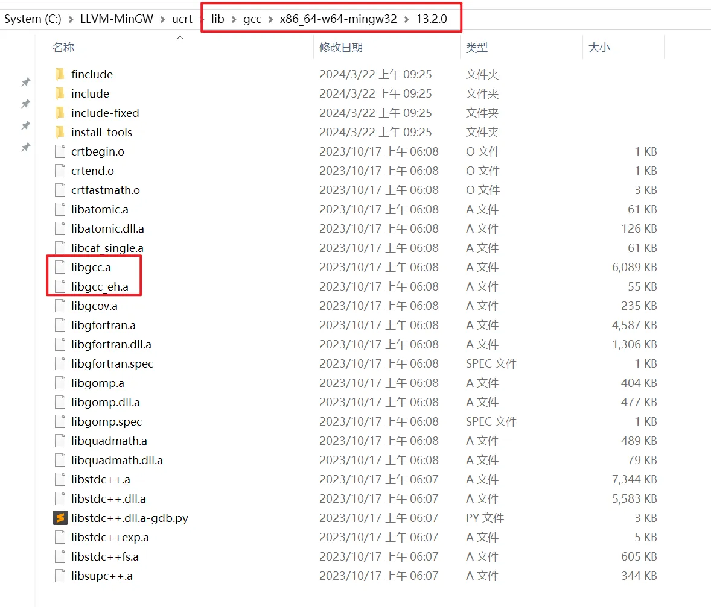
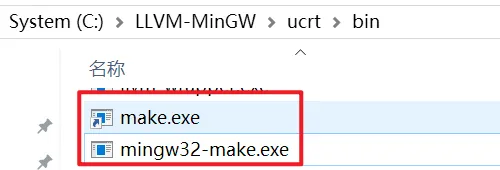
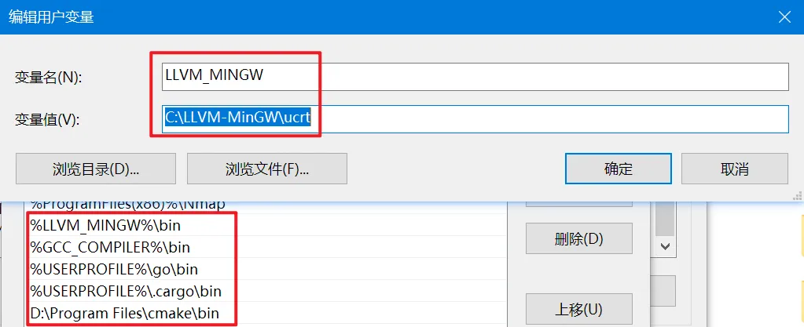
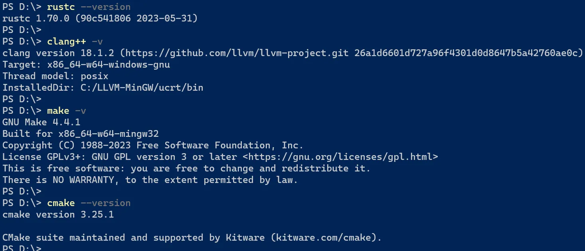
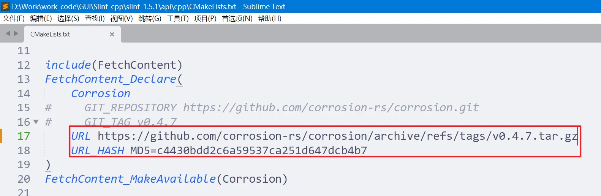

# Slint-Cpp 静态编译

## 安装Rust和C++工具链

* **Slint**是基于Rust语言开发的，所以编译Slint-cpp需要Rust工具链C++工具链
* 本文将使用**Rust:x86_64-pc-windows-gnu + Cpp:llvm-mingw-20240320-ucrt-x86_64**工具链编译

### 参考链接
* [Releases · mstorsjo/llvm-mingw](https://github.com/mstorsjo/llvm-mingw/releases)
* [Releases · niXman/mingw-builds-binaries](https://github.com/niXman/mingw-builds-binaries/releases)

### 注意事项

* 安装好**llvm-mingw-20240320-ucrt-x86_64**工具链后编译Slint-Cpp时会出现找不到**libgcc.a**和**libgcc_eh.a**的情况, 通过搜索发现**libgcc.a**和**libgcc_eh.a**这两个库包含在**MinGW-w64(x86_64-13.2.0-release-posix-seh-ucrt-rt_v11-rev1)**工具链中, 所以需要将MinGW-w64工具链下的**lib\gcc**目录拷贝到LLVM-MinGW工具链的**lib**目录下

* 

* 本次编译使用CMake工具，CMake依赖于GNU-Make, 需要把**LLVM-MinGW**工具链**bin**目录下的**mingw32-make.exe**工具拷贝重命名为**make.exe**
* 

* 安装完工具链后把**LLVM-MinGW**工具链**bin**目录加入到环境变量中，同时新建一个名为**HOME**的环境变量，其值为**%USERPROFILE%**
* 
* 

### 检查工具链
* 

## 开始编译Slint-Cpp
### 修改Corrosion-rs包下载方式
* 默认Slint-Cpp编译时需要通过git在线下载**corrosion-rs**包, 但是由于我们是Windows环境没有git工具, 所以需要修改corrosion-rs包的下载方式, 这里使用**HTTP**方式下载
* 

```bash
URL https://github.com/corrosion-rs/corrosion/archive/refs/tags/v0.4.7.tar.gz
URL_HASH MD5=c4430bdd2c6a59537ca251d647dcb4b7
```

### 编译参数
```bash
cmake -G "MinGW Makefiles" -B "my_build" \
  -DCMAKE_BUILD_TYPE:STRING=MinSizeRel \
  -DBUILD_SHARED_LIBS:BOOL=OFF \
  -DSLINT_FEATURE_RENDERER_FEMTOVG:BOOL=OFF \
  -DSLINT_FEATURE_RENDERER_SOFTWARE:BOOL=ON \
  -DRust_CARGO_TARGET=x86_64-pc-windows-gnu \
  -DSLINT_STYLE=native \
  -DDEFAULT_SLINT_EMBED_RESOURCES:STRING=embed-for-software-renderer \
  -DCMAKE_CXX_COMPILER:STRING="C:/LLVM-MinGW/ucrt/bin/clang++.exe" \
  -DCMAKE_C_COMPILER:STRING="C:/LLVM-MinGW/ucrt/bin/clang.exe" \
  -DCMAKE_MAKE_PROGRAM:FILEPATH="C:/LLVM-MinGW/ucrt/bin/make.exe" \
  -DCMAKE_CXX_FLAGS:STRING="-Os -flto -DNDEBUG -ffunction-sections -fdata-sections" \
  -DCMAKE_C_FLAGS:STRING="-Os -flto -DNDEBUG -ffunction-sections -fdata-sections" \
  -DCMAKE_CXX_STANDARD_LIBRARIES:STRING="-lkernel32 -luser32 -lgdi32 -lwinspool -lshell32 -lole32 -loleaut32 -luuid -lcomdlg32 -ladvapi32 -lcomctl32 -liphlpapi -lws2_32 -lntoskrnl -lbcrypt -lopengl32 -luiautomationcore -lpropsys -ldwmapi -limm32 -luxtheme -luserenv" \
  -DCMAKE_CXX_STANDARD_LIBRARIES:STRING="-lkernel32 -luser32 -lgdi32 -lwinspool -lshell32 -lole32 -loleaut32 -luuid -lcomdlg32 -ladvapi32 -lcomctl32 -liphlpapi -lws2_32 -lntoskrnl -lbcrypt -lopengl32 -luiautomationcore -lpropsys -ldwmapi -limm32 -luxtheme -luserenv" \
  -DCMAKE_STATIC_LINKER_FLAGS:STRING="-Os -DNDEBUG -Wl,--gc-sections" \
  -DCMAKE_INSTALL_PREFIX:PATH="my_install"
```

### 编译脚本
```bat
@echo off

set cmake_exe=_FULL_PATH_TO_CMAKE_EXE_
set upx_exe=_FULL_PATH_TO_UPX_EXE_
set llvm_dir=_FULL_PATH_TO_LLVM_TOOLCHAIN_
rem example: C:/LLVM-MinGW/ucrt

set strip_exe=%llvm_dir%/bin/llvm-strip.exe

set build_dir=my_build
set install_dir=my_install

set cflags=-Os -flto -DNDEBUG -ffunction-sections -fdata-sections
set ldlibrary=-lkernel32 -luser32 -lgdi32 -lwinspool -lshell32 -lole32 -loleaut32 -luuid -lcomdlg32 -ladvapi32 -lcomctl32 -liphlpapi -lws2_32 -lntoskrnl -lbcrypt -lopengl32 -luiautomationcore -lpropsys -ldwmapi -limm32 -luxtheme -luserenv
set ldflags=-Os -DNDEBUG -Wl,-subsystem,windows -Wl,--gc-sections

echo "Del build cache"
rmdir /s /q %build_dir%
rmdir /s /q %install_dir%
mkdir %build_dir%
mkdir %install_dir%
call :my_sleep

echo "Run cmake generator"
%cmake_exe% -G "MinGW Makefiles" -B "%build_dir%" ^
	-DCMAKE_VERBOSE_MAKEFILE:BOOL=ON ^
	-DCMAKE_BUILD_TYPE:STRING=MinSizeRel ^
	-DBUILD_SHARED_LIBS:BOOL=OFF ^
	-DSLINT_STYLE=native ^
	-DSLINT_FEATURE_RENDERER_FEMTOVG:BOOL=OFF ^
	-DSLINT_FEATURE_RENDERER_SOFTWARE:BOOL=ON ^
	-DRust_CARGO_TARGET=x86_64-pc-windows-gnu ^
	-DDEFAULT_SLINT_EMBED_RESOURCES:STRING=embed-for-software-renderer ^
	-DCMAKE_CXX_COMPILER:STRING="%llvm_dir%/bin/clang++.exe" ^
	-DCMAKE_MAKE_PROGRAM:FILEPATH="%llvm_dir%/bin/mingw32-make.exe" ^
	-DCMAKE_C_COMPILER:STRING="%llvm_dir%/bin/clang.exe" ^
	-DCMAKE_CXX_FLAGS:STRING="%cflags%" ^
	-DCMAKE_C_FLAGS:STRING="%cflags%" ^
	-DCMAKE_CXX_STANDARD_LIBRARIES:STRING="%ldlibrary%" ^
	-DCMAKE_C_STANDARD_LIBRARIES:STRING="%ldlibrary%" ^
	-DCMAKE_STATIC_LINKER_FLAGS:STRING="%ldflags%" ^
	-DCMAKE_EXE_LINKER_FLAGS:STRING="%ldflags%" ^
	-DCMAKE_INSTALL_PREFIX:PATH="%install_dir%"
if %errorlevel% neq 0 goto my_error
call :my_sleep

echo "Run cmake build [%cmake_exe% --build %build_dir%]"
%cmake_exe% --build %build_dir%
if %errorlevel% neq 0 goto my_error
call :my_sleep

echo "Run install [%cmake_exe% --install %build_dir%]"
%cmake_exe% --install %build_dir%
if %errorlevel% neq 0 goto my_error
goto my_success

:my_sleep
rem echo "wait 1s ..."
ping 127.0.0.1 -n 2 > nul
goto :eof

:my_success
echo "Build success!"
goto :eof

:my_error
echo "Build failed!"
goto :eof
```


## Hello World

* [Slint-cpp Static Hello World](https://github.com/WHJWNAVY/slint-cpp-static-template)
